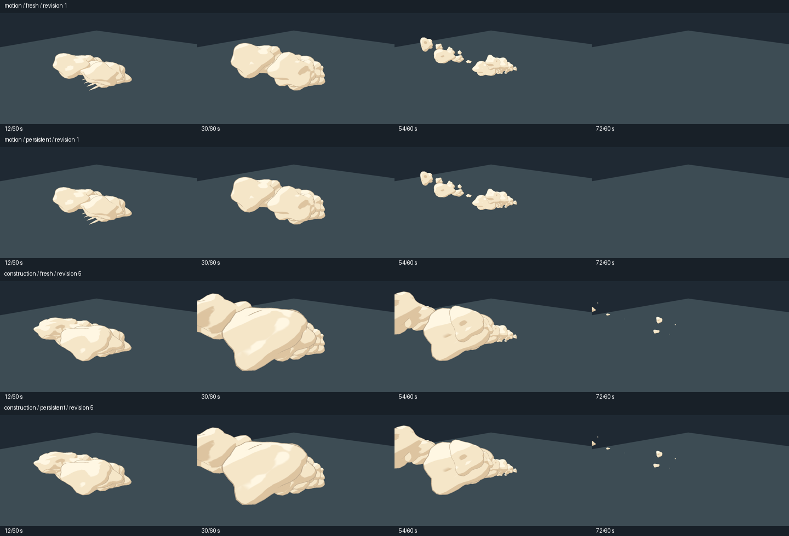

# VFX確認待ちの実測（2026-10-11）

既存のトゥーン土ぼこりを10回調整し、コード保存から4枚のPNGが揃うまでを比較した。常駐セッションでは確認待ちが約53%短くなった。VFXを一から考えて制作する人間の時間は計測していない。

## 結果

各条件5回の中央値。終了待ちは次の表に含めず、CSVへ別項目で記録した。

| 調整内容 | 通常起動 | 常駐セッション | 短縮 |
|---|---:|---:|---:|
| 房の巻き上がる動き | 3.42秒 | 1.59秒 | 53.5% |
| 粒数変更・シーン再構築 | 3.40秒 | 1.58秒 | 53.6% |

10回の確認待ちの実測合計は、通常 34.84秒、常駐 15.94秒。常駐の初回起動・初期配置 2.58秒も加えると 18.52秒。ウォームアップ、実験準備、画像照合、人間の制作・観察時間はこの合計に含まない。

反映・準備のみの中央値は、動きの変更で通常 2.173秒／常駐 0.033秒、粒数変更で通常 2.162秒／常駐 0.042秒。常駐の利点は起動待ちを繰り返さない点にある。

## 条件と手順

- 計測開始: 2026-10-11T15:32:40.206634+09:00。Windows-11-10.0.26200-SP0、Python 3.12.10。
- Godot Engine v4.7.2.stable.official.ed1daf0bf - https://godotengine.org / Vulkan 1.3.289 - Forward+ - Using Device #0: NVIDIA - NVIDIA GeForce RTX 4060
- 既存の `godot/scripts/sculpted_dust.gd` を無視対象の一時ファイルへコピー。本編のVFXは変更しない。
- 同じカメラ・床・1600×900のSubViewport、60Hzの物理時計。12・30・54・72コマでPNGを生成。
- 動きの変更: 巻き上がりの係数を3.35、3.70、4.05、4.40、4.75へ変更。常駐側はreload後、既存インスタンスの時刻を戻して再生。
- 初期化の変更: 上記の動きの変更に加えて房を9〜13個へ変更。常駐側もreload後にloadでシーンを再構築。
- 通常側: 毎回新しいGodotを `--script fresh_capture.gd` で起動。開発ランタイム・TCP・エディタを使わず、自動で撮影して終了。
- 常駐側: 初回だけ起動し、同じPIDで更新・コマ送り・撮影。両側とも画面外で起動してウィンドウを隠し、デスクトップを占有しない。
- 両側を1回ずつウォームアップ後、通常→常駐／常駐→通常の順を交互にして各条件5ペアを逐次実行。インポート・ドライバーキャッシュは既存のものを使用。

## 一致確認と限界

- 10ペア×4時点の40枚について、対応する画像の全ピクセルが一致。各条件で異なる5変更が実際に異なる画像になることも確認。
- 同じ物理時刻・粒数を確認。動きの変更では常駐側のインスタンスを維持し、84コマ後には寿命で片付いた。エンジンログに描画・スクリプトのエラーなし。
- 撮影待ちには常駐側のRPC往復も含む。通常側はエンジン内で自動撮影するため、再生・撮影部分だけなら通常側の方が短い。
- 通常側は起動終了が軽い単体の撮影スクリプト。エディタの起動時間や、大きなゲームシーンの読み込み時間は比較対象にしていない。
- VFX品質や制作判断が53%速くなるという結果ではない。画像・GLBの再インポート、GPUParticlesのランダム表現、他のPC・シーンも未計測。単発確認では常駐の初回起動費用がある。
- 画像を連続コマで目視確認した。通常速度の動画視聴を行ったという報告ではない。

## 再実行

```powershell
python tools/benchmark_vfx_session.py --pairs 5
```

PythonのPillowが必要。出力先の既定値は `godot/.godot/dev_session/vfx_benchmark/`。JSONは個々の時間・状態・画像照合結果、CSVは全20試行の計測値を収録する。

[生データJSON](dev-session-vfx-2026-10-11.json) · [全試行CSV](dev-session-vfx-2026-10-11.csv)


